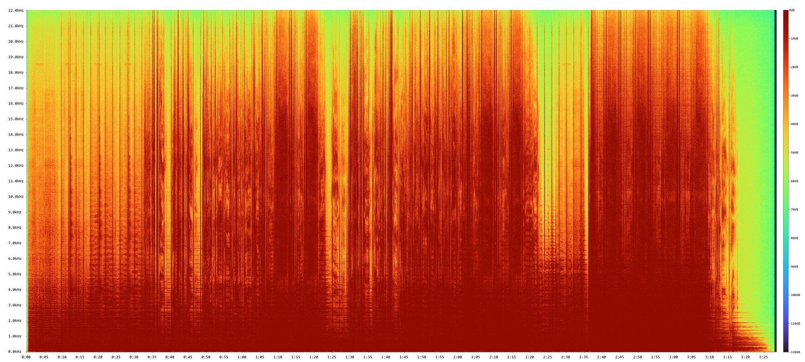

 # AudioSpectrogram

AudioSpectrogram 是一个功能强大的音频频谱图生成工具，支持多种音频格式，可生成高质量的频谱图。使用 Rust 语言开发，提供跨平台支持，可在 Windows、macOS 和 Linux 系统上运行。

## 功能特点

- 跨平台支持（Windows、macOS、Linux）
- Windows 平台支持文件拖拽操作
- 支持多种音频格式：WAV、MP3、FLAC、OGG、AAC 等
- 使用 Turbo 色彩映射生成高质量频谱图
- 自动处理多声道音频（混合为单声道）
- 精确的时间和频率刻度
- 完整的 dB 刻度显示（-120dB 到 0dB）
- 可自定义 FFT 大小和 hop size

## 示例频谱图



这是使用本工具生成的频谱图示例，展示了 OneRepublic 的 "Apologize"（44.1kHz 采样率）。频谱图清晰地展示了：

- 完整的频率范围（0-22.05kHz）
- 清晰的时间轴标记
- 精确的频率刻度
- 丰富的动态范围显示（-120dB 到 0dB）

## 系统要求

- Rust 工具链（推荐通过 [rustup](https://rustup.rs/) 安装）
- Cargo（Rust 包管理器，随 Rust 一起安装）
- 系统需要安装至少一种等宽字体：
  - Windows：Consolas
  - macOS：Monaco
  - Linux：DejaVu Sans Mono

## 编译步骤

1. 克隆仓库：

```bash
git clone https://github.com/lmshao/AudioSpectrogram.git
cd AudioSpectrogram
```

2. 编译项目：

```bash
cargo build --release
```

编译后的可执行文件将位于 `target/release` 目录下。

## 使用方法

基本用法：

```bash
AudioSpectrogram -i input.mp3
```

在 Windows 系统上，你可以直接将音频文件拖拽到程序图标上，程序会自动生成频谱图。这是最简单的使用方式。

或者在命令行中直接指定文件：

```bash
AudioSpectrogram input.mp3
```

### 命令行参数

- `-i, --input <FILE>`：输入音频文件路径
- `-o, --output <FILE>`：输出图片路径（可选，默认为与输入文件同名的 PNG 文件）
- `-f, --fft-size <SIZE>`：FFT 大小（可选，默认为 4096）
- `-p, --hop-size <SIZE>`：Hop 大小（可选，默认为 FFT 大小的一半）

### 使用示例

1. 使用默认参数生成频谱图：

```bash
AudioSpectrogram -i music.flac
```

2. 指定输出文件名：

```bash
AudioSpectrogram -i music.flac -o spectrum.png
```

3. 自定义 FFT 参数：

```bash
AudioSpectrogram -i music.flac -f 8192 -p 2048
```

### 输出说明

生成的频谱图包含以下信息：

- 垂直轴：频率刻度（kHz）
- 水平轴：时间刻度（分:秒）
- 右侧：dB 刻度（-120dB 到 0dB）
- 颜色映射：使用 Turbo 色彩方案，红色表示强度高，蓝色表示强度低

## 许可证

本项目采用 MIT 许可证。详见 [LICENSE](LICENSE) 文件。
